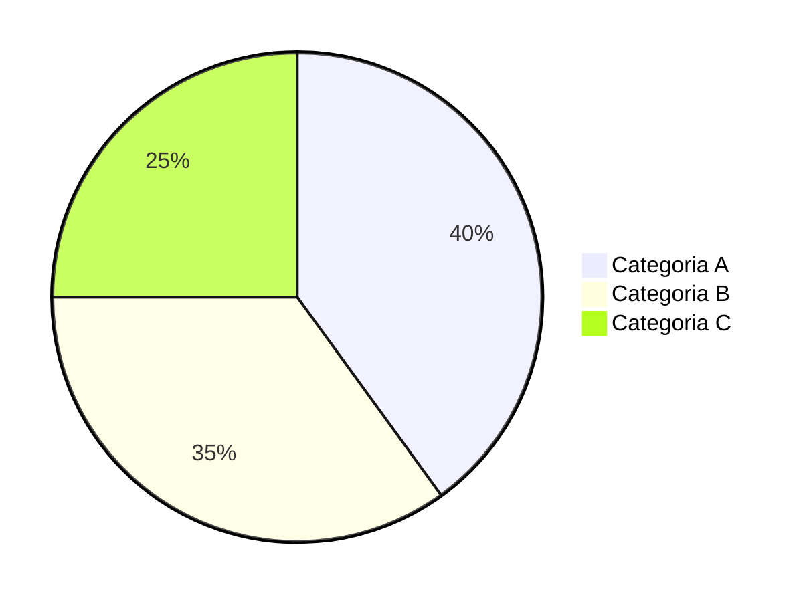

# 12.1 Controle Whitelabel

**Módulo:** 12. Whitelabel (Desktop)  
**Tipo:** Redirect  
**Plano:** **Tax (Add-on)**  
**Complexidade:** Média

## Resumo
Controle Whitelabel

## Observações
CMS simples

## Flags
- **CoinStat:** Não
- **Delta:** Não

## Requisitos/Tarefas
- [ ] Definição de métricas e fontes
- [ ] Modelagem de dados e normalização
- [ ] Integração/Oráculos necessários
- [ ] UX: layouts e filtros
- [ ] Testes e validações
- [ ] Documentação

## Critérios de Aceite (exemplos)
- [ ] Resultados consistentes com fontes de referência
- [ ] Performance adequada com N contas/subcontas
- [ ] Logs e auditoria mínimos
- [ ] Tratamento de erros e timeouts

# 12. Whitelabel (Desktop) — Controle Whitelabel

> **Objetivo:** Configurar branding e domínios por tenant.  
> **Problema:** Gestão manual de marcas e DNS.  
> **Solução:** Temas, ativos e DNS whitelabel.  
> **Proposta de Valor:** Escalabilidade sem forks.  
> **KPIs chave:** tempo de setup, incidentes

## Endpoint
- **GET/POST:** `/api/v1/whitelabel-desktop/controle-whitelabel`  
- **URL completa:** <https://api.pipview.local/api/v1/whitelabel-desktop/controle-whitelabel>  
- **Auth:** Bearer JWT | **Tenant:** `X-Tenant-Id`

### Request (exemplo)
```json
{
  "filters": {
    "wallet_ids": ["w1", "w2"],
    "date_range": {"start": "2025-01-01", "end": "2025-10-26"},
    "assets": ["BTC","ETH","USDT"]
  },
  "probe": true
}
```

### Response (exemplo)
```json
{
  "status": "ok",
  "feature": "controle-whitelabel",
  "items": [],
  "metrics": {"latency_ms": 120}
}
```

## Fontes de Dados
- Exchanges (API) e carteiras on-chain monitoradas
- Cotações históricas consolidadas
- Dicionários de símbolos, redes e categorias

## Gráficos Sugeridos
- Selecionar entre pizza, barras, linha, área ou bolhas conforme o caso
- Filtros por data, carteira, ativo, rede, categoria

## Premissas
- Normalização de símbolos/contratos e timezone do usuário
- Preço de fechamento diário e intraday quando necessário

## Regras de Negócio
- Agregação consistente por `timestamp`
- Arredondamento configurável e ocultação de *dust*
- Rastreamento de origem (auditoria)

## Presentation
12. Whitelabel (Desktop) — Controle Whitelabel


