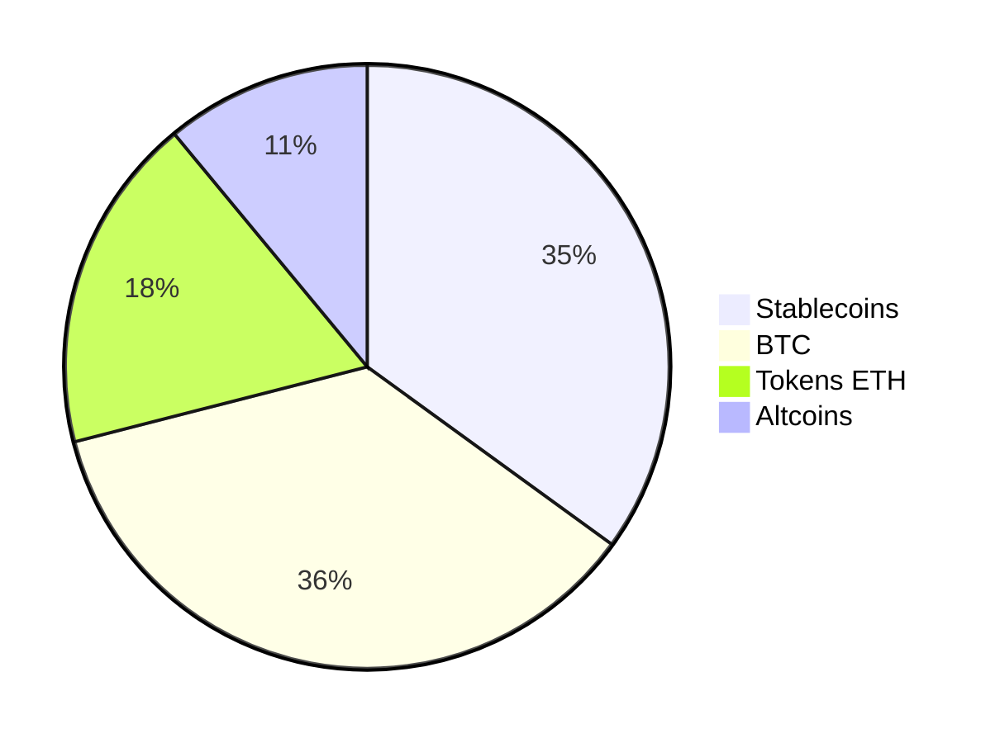

# Advisor — Conectar advisor terceiro

> **Criação Data:** 2025-10-25  
> **Criação Autor:** Maikel Goulart  
> **Aualização Data:** 2025-10-25  
> **Aualização Autor:** Maikel Goulart  
> **Objetivo:** Descrever a funcionalidade "Conectar advisor terceiro" dentro do módulo Advisor.
> **Problema:** Necessidade de visibilidade e ação estruturada para este caso de uso.
> **Solução:** Disponibilizar endpoints, dados e visualizações padronizadas.
> **Proposta de Valor:** Clareza, automação e governança para decisões mais rápidas.
> **KPIs chave:** adoção de uso, latência de consulta, cobertura de dados.

## Endpoint

- **GET/POST:** `/api/v1/advisor/conectar-advisor-terceiro`  
- **URL completa:** <https://api.pipview.local/api/v1/advisor/conectar-advisor-terceiro>  
- **Auth:** Bearer JWT | **Tenant:** `X-Tenant-Id`

### Request (exemplo)

```json
{
  "filters": {
    "wallet_ids": ["w1", "w2"],
    "date_range": {"start": "2025-01-01", "end": "2025-10-26"}
  },
  "probe": true
}
```

### Response (exemplo)

```json
{
  "status": "ok",
  "feature": "conectar-advisor-terceiro",
  "items": [],
  "metrics": {"latency_ms": 120}
}
```

## Fontes de Dados

- Exchanges (API) e carteiras on-chain monitoradas
- Cotações históricas consolidadas
- Dicionários de símbolos, redes e categorias

## Gráficos Sugeridos

- Definir gráficos adequados (pizza, barras, linha, área) conforme o caso
- Filtros por data, carteira, ativo, rede, categoria

## Premissas

- Normalização de símbolos/contratos e timezone do usuário
- Preço de fechamento diário e intraday quando necessário

## Regras de Negócio

- Agregação consistente por `timestamp`
- Arredondamento configurável e ocultação de *dust*
- Rastreamento de origem (auditoria)

## Presentation

Advisor — Conectar advisor terceiro


