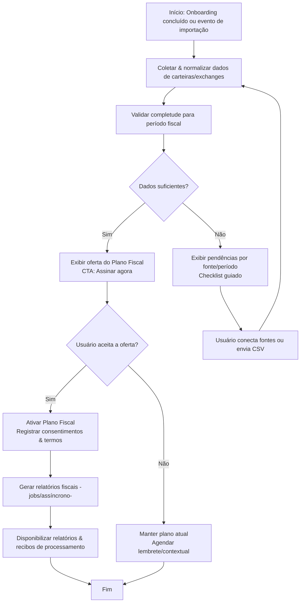
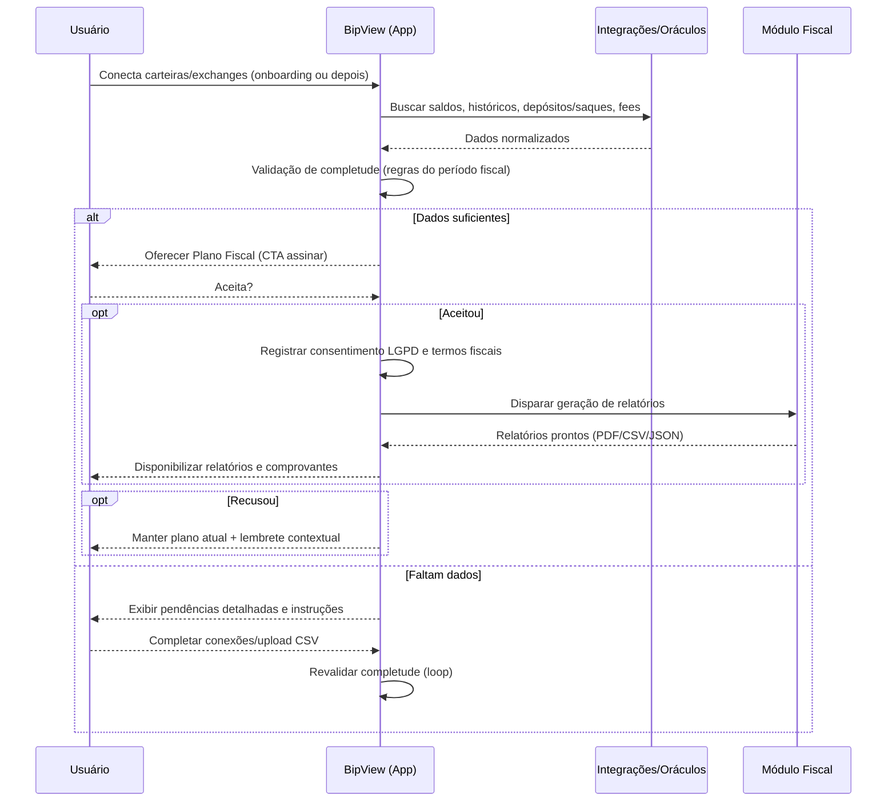

# Fluxo Upsell — Plano Fiscal (BipView)

> **Versão:** 1.0  
> **Data:** 25/10/2025  
> **Contexto:** O fluxo habilita um **upsell contextual** do Plano Fiscal quando a aplicação detecta **dados suficientes** para gerar relatórios contábeis/fiscais a partir de carteiras e exchanges conectadas. Caso contrário, apresenta **pendências de dados** e guia o usuário para completar a integração.

---

## 1) Objetivo do Fluxo

- Aumentar a conversão para o **Plano Fiscal** com uma oferta **no momento certo** (quando há dados suficientes).
- Reduzir fricção com **diagnóstico automático de completude** e **checklist de pendências**.
- Garantir **conformidade** (LGPD/consentimento, termos de uso fiscal) antes de ativar o plano.

---

## 2) Pontos de Entrada (Triggers)

1. **Fim do Onboarding:** após conectar 1+ carteiras/exchanges.
2. **Reconciliação Periódica:** jobs (ex.: diário) que revalidam completude.
3. **Eventos de Importação:** upload de CSV/extrato, conexão de nova fonte.
4. **Navegação do Usuário:** ao acessar telas de impostos/relatórios.

---

## 3) Regras de Completude (critério "dados suficientes")
>
> As regras podem ser parametrizadas por país/ano fiscal. Exemplo para BR:

- **Transações**: presença de histórico de **trades, depósitos e saques** desde a data de corte do ano fiscal ou do primeiro evento conhecido.
- **Saldos Iniciais**: saldo por ativo na **data inicial** do período ou no primeiro evento.
- **Cotações**: acesso a **oráculos de preço** para marcação a mercado (fechamento diário).
- **Identificação de Ativos**: mapeamento de **tickers/contratos** para taxonomia interna (moedas, tokens, NFTs).
- **Metadados de Exchange/Wallet**: timezone, fees, tipos de operação, tx-hash, referência de par (ex.: BTC/USDT).
- **Integridade mínima**: tolerância de **dados faltantes < N%** do volume transacional e **sem lacunas** críticas (> X dias) no período.

> **Observação:** Se qualquer critério falhar, o sistema lista **pendências** específicas (por fonte/intervalo/arquivo).

---

## 4) Decisão de Upsell (Lógica)

- **Se COMPLETO:** exibir **oferta do Plano Fiscal** (modal/banner inline) com CTA.
- **Se INCOMPLETO:** exibir **checklist de pendências** com passos de ação (conectar fontes, importar CSV, corrigir timezone, reprocessar).

---

## 5) Experiência do Usuário (UX copy sugerida)

- **Oferta (completo):**  
  “Detectamos dados suficientes para gerar seus **relatórios fiscais**. Assine o **Plano Fiscal** e tenha tudo pronto em minutos.”
  - CTA primário: **Assinar agora**  
  - CTA secundário: **Ver o que será gerado** (prévia do relatório)

- **Pendências (incompleto):**  
  “Faltam algumas informações para gerar seus relatórios. Conclua as etapas abaixo:”  
  - Checklist por **Fonte → Tipo de dado → Período** (ex.: *Binance → Trades → Jan–Mar/2025*).  
  - Ações guiadas: **Conectar**, **Importar CSV**, **Reprocessar**, **Ignorar período** (com aviso).

- **Recusa de Upsell:**  
  “Sem problemas — manteremos seu plano atual. Você pode ativar o Plano Fiscal quando preferir.”

---

## 6) Fluxo (Mermaid — Flowchart)

---

## 7) Diagrama de Sequência (Mermaid)

---

## 8) Estados & Mensageria

- **states**: `onboarding_done`, `collecting`, `validating`, `ready_for_upsell`, `upsell_shown`, `accepted`, `declined`, `pending_data`, `tax_generating`, `tax_ready`.
- **eventos** (exemplos):
  - `wallet_connected`, `exchange_connected`, `csv_uploaded`, `prices_synced`.
  - `completeness_passed`, `completeness_failed`.
  - `tax_generation_started`, `tax_generation_completed`.
  - `upsell_shown`, `upsell_accepted`, `upsell_declined`.
- **notificações**: push/email in-app para conclusões, pendências, término de geração fiscal.

---

## 9) Interfaces (alto nível)

- **GET /completeness?period=YYYY** → status por fonte/tipo/intervalo.
- **POST /upsell/fiscal/accept** → ativa o plano (registra consentimentos/termos).
- **POST /tax/generate** → dispara geração por período.
- **GET /tax/reports?period=YYYY** → lista e baixa relatórios.
- **POST /import/csv** → upload seguro por fonte/tipo.
- **GET /sources** / **POST /sources/connect** → gestão de integrações.

> **Observação:** proteger com escopos/tenants; auditar chamadas (WORM/S3).

---

## 10) Checklist de Conformidade (LGPD & Auditoria)

- Consentimento explícito para **tratamento de dados fiscais** (finalidades e base legal).
- Retenção e descarte alinhados ao **período legal**.
- **Minimização de dados**: coletar só o necessário (hash/txid quando possível).
- **Trilhas de auditoria**: logs imutáveis (S3 Object Lock/WORM).
- Termos de uso e aceite de **responsabilidade fiscal** antes da geração.

---

## 11) Métricas & Experimentação

- **Taxa de exibição de upsell** = upsell_shown / sessões elegíveis.
- **Conversão** = upsell_accepted / upsell_shown.
- **Time-to-complete** pendências = tempo entre `completeness_failed` e `passed`.
- **Qualidade de dados** = % de lacunas por período/fonte.
- **A/B Testes**: variante de copy/CTA, posição do banner vs modal.

---

## 12) Estados de Erro & Reprocessamento

- **Falha de integração** (API rate limit, auth expirada) → sugerir reconexão.
- **CSV inválido** → feedback de coluna/linha; template de exemplo.
- **Preços não encontrados** → filas para backfill de cotações.
- **Conflitos de timezone** → assistente para normalizar datas.

---

## 13) Próximos Passos (Implementação)

- Definir **tabela de regras** por país/ano (YAML).
- Implementar `GET /completeness` com granularidade por **fonte/período**.
- Criar **componentes UI**: banner, modal, checklist, cards de relatório.
- Orquestrar **jobs de geração fiscal** e armazenamento (PDF/CSV/JSON).
- Instrumentar **telemetria** (eventos descritos nas seções 8 e 11).

---

**FIM** — Este documento pode ser versionado em `docs/upsell/upsell_plano_fiscal.md` dentro do repositório de documentação técnica.
