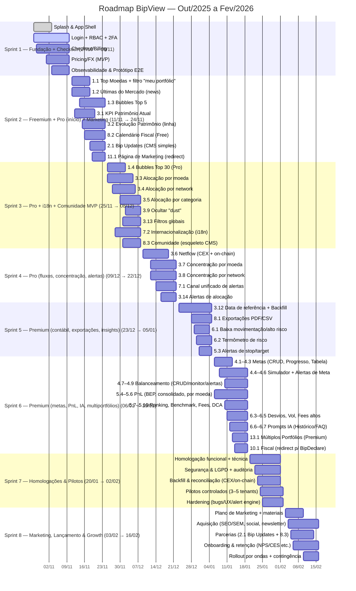

# Roadmap por Sprints — BipView (2 semanas)

**Data de geração:** 2025-10-28 (GMT-3)

Inclui os itens obrigatórios: **10.1 Fiscal (redirect p/ BipDeclare)**, **11.1 Página de Marketing (redirect)**, **8.3 Comunidade (esqueleto CMS)**, **8.x Extras (8.1/8.2)** e **13.1 Controle de Múltiplos Portfólios**. Ao final há uma tabela “onde entra” para rastreabilidade.

---

## Sprint 1 — Fundação + Checkout (27/Out/2025 → 10/Nov/2025)

- **Splash Screen**; App shell (dark/light).
- **Cadastro & Login + RBAC** (tenant/roles).
- **Segurança**: 2FA (TOTP), FaceID/biometria (quando disponível), políticas de senha.
- **Checkout/Billing**: planos Free/Pro/Premium + Tax (add-on), trial, cupons, feature flags.
- **Pricing/FX (MVP)**: oráculos, cache, normalização.
- **Observabilidade**: logs, métricas, tracing e manuseio de erros.
- **Protótipo navegável** end-to-end de todas funcionalidades.

**Critérios de aceite**

- Fluxo Splash → Login/2FA → App OK.
- Checkout com gating por plano em HML.
- Preços/FX disponíveis via API interna para módulos Free.

---

## Sprint 2 — Freemium + Pro (início) + Marketing redirect (11/Nov/2025 → 24/Nov/2025)

**Free**

- **1.0** Implementação de todos endpoints mockados (Backend)
- **1.1** Top moedas ↑/↓ (cards/tabela **ou** barras; toggle “somente meu portfólio”).
- **1.2** Últimas notícias do mercado (cards/links – fontes whitelist).
- **1.3** Bubbles Top 5 (valoriz./desvaloriz.).
- **3.1** KPI Patrimônio Atual (FIAT).
- **3.2** Evolução do Patrimônio (linha).
- **8.2** **Calendário Fiscal** (BR).

**Pro (início)**

- **2.1** Bip Updates (cards com CMS simples).

**Add-ons / Marketing**

- **11.1** **Página de Marketing (redirect)**.

---

## Sprint 3 — Pro (alocação, filtros, i18n) + Comunidade MVP (25/Nov/2025 → 08/Dez/2025)

- **1.4** Bubbles Top 30 (Pro).
- **3.3** Alocação por moeda (pie/treemap).
- **3.4** Alocação por network (pie por chain).
- **3.5** Alocação por categoria (stable/alt/ETH…).
- **3.9** Ocultar “dust” (limiar valor/%).
- **3.13** Filtros por moeda/exchange/conta.
- **7.2** Internacionalização (pt-BR/en, datas/números).
- **8.3** **Comunidade (esqueleto CMS)** — posts estáticos, sem moderação avançada.

---

## Sprint 4 — Pro (fluxos, concentração, alertas) (09/Dez/2025 → 22/Dez/2025)

- **3.6** Netflow (In/Out — CEX + on-chain).
- **3.7** Concentração por moeda (lista + alertas).
- **3.8** Concentração por network (lista + alertas).
- **3.14** Alertas de alocação (overexposure).
- **7.1** Canal unificado de alertas (push/email/webhook, throttling, preferências).

---

## Sprint 5 — Premium (contábil, exportações, primeiros insights) (23/Dez/2025 → 05/Jan/2026)

- **3.12** Visualização por **data de referência** (corte “contábil” + backfill consistente).
- **8.1** **Exportações PDF/CSV** (layouts, paginação).
- **6.1** Alertas de baixa movimentação/alto risco (heurísticas).
- **6.2** Termômetro de risco (score visual).
- **5.3** Alertas de stop/target.

---

## Sprint 6 — Premium (metas, operação & PnL, IA, multiportfólios) (06/Jan/2026 → 19/Jan/2026)

**Planejamento (Pro)**

- **4.1** CRUD de metas; **4.2** Progresso; **4.3** Tabela vs meta.
- **4.4** Simulador de metas (what-if); **4.5–4.6** Alertas de meta.
- **4.7–4.9** Balanceamento de portfólio (CRUD + monitoramento + alertas).

**Operação & PnL (Premium)**

- **5.4** Break-even; **5.5** PnL consolidado; **5.6** PnL por moeda (FIFO/LIFO).
- **5.7** Ranking; **5.8** Benchmark; **5.9** Fees; **5.10** DCA/backtest.

**Insights (Premium)**

- **6.3** Desvios de carteira; **6.4** Volatilidade; **6.5** Fees altos.
- **6.6** Prompt IA (Dados históricos); **6.7** Prompt IA (FAQ Declare).

**Acesso/Multi-tenant (Premium)**

- **13.1** **Controle de Múltiplos Portfólios** (switch/escopos por tenant/conta).

**Add-on Fiscal**

- **10.1** **Fiscal (redirect para BipDeclare)** — SSO/redirect (sem emissão interna nesta fase).

---

## Sprint 7 — Homologações & Pilotos (20/Jan/2026 → 02/Fev/2026)

- **Homologação funcional**: regressão, contratos de dados, filtros, multi-moeda, data de referência.
- **Homologação técnica**: carga/performance, caching, limites/paginação, observabilidade SLO.
- **Segurança & compliance**: RBAC, auditoria, SAST/DAST, revisão LGPD.
- **Backfill & consistência**: reconciliação amostral CEX/on-chain; validação Netflow e PnL.
- **Pilotos controlados**: 3–5 tenants (BR/LatAm); coleta de feedback/UX.
- **Hardening**: bugs alta/média, UX crítico, estabilidade alert engine.

---

## Sprint 8 — Marketing, Lançamento & Growth (03/Fev/2026 → 16/Fev/2026)

- **Homologação funcional**: regressão, contratos de dados, filtros, multi-moeda, data de referência.
- **Plano de Marketing**: posicionamento, mensagens por tier, pricing final; materiais (LP, blog, media kit).
- **Aquisição**: SEO/SEM básicos; **11.1 Página de Marketing (redirect)** no funil; newsletter e social.
- **Parcerias**: conteúdos com parceiros (**2.1 Bip Updates**), influenciadores e **8.3 Comunidade**.
- **Onboarding & retenção**: e-mails de ativação, checklists, NPS/CES, tutoriais.
- **Medição**: analytics (eventos-chave, cohort); metas trial→paid por tier.
- **Plano de rollout**: ondas por região/tenant; contingência/rollback.

---

## Tabela de rastreabilidade (itens-chave)

| Item | Sprint |
|---|---|
| **8.1 Exportações PDF/CSV** | **S5** |
| **8.2 Calendário Fiscal (Free)** | **S2** |
| **8.3 Comunidade (esqueleto CMS)** | **S3** |
| **9.1 Trade na plataforma** (V2/V3) | Pós-S8 (depende de compliance & risco) |
| **10.1 Fiscal (redirect p/ BipDeclare)** | **S6** |
| **11.1 Página de Marketing (redirect)** | **S2** |
| **13.1 Controle de Múltiplos Portfólios** | **S6** |

---

## Dependências críticas

- **Pricing/FX (S1)** → habilita 1.1, 3.1, 3.2 e demais KPIs.
- **RBAC + Checkout (S1)** → gating por plano nas S2–S6.
- **Normalização por conta/subconta (S1–S2)** → 3.2, 3.3–3.6, PnL.
- **Alert Engine + Notificações (S4)** → 3.7–3.9, 3.14, 4.5–4.9, 5.3, 6.x.

---

### Observações rápidas

- **1.1/1.3/1.4** podem compartilhar serviços de pricing/caching para reduzir custo.
- **3.12** (contábil) requer **backfill consistente** e controle de cortes (TZ BR).
- **5.x** (PnL/Fees) exige definição de lotes FIFO/LIFO e reconciliação com CEX.
- **6.x** dependem de canal de alertas (S4) e parâmetros por tenant.
- **8.3** inicia simples (estático); moderação/curadoria vêm pós-MVP.

